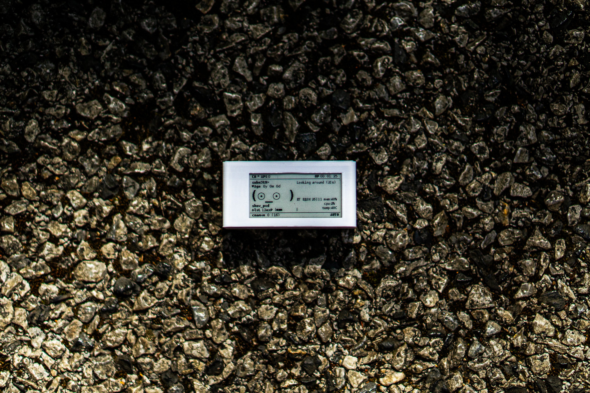
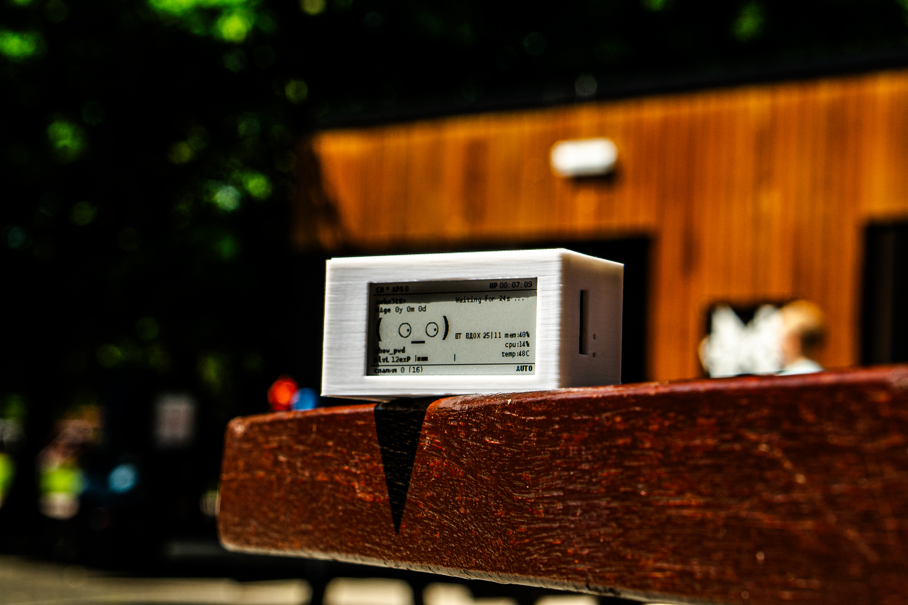
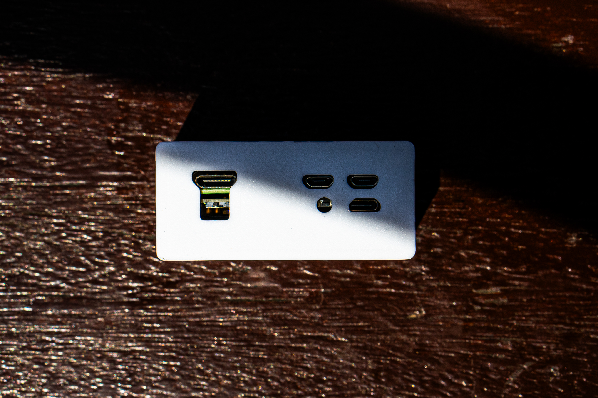
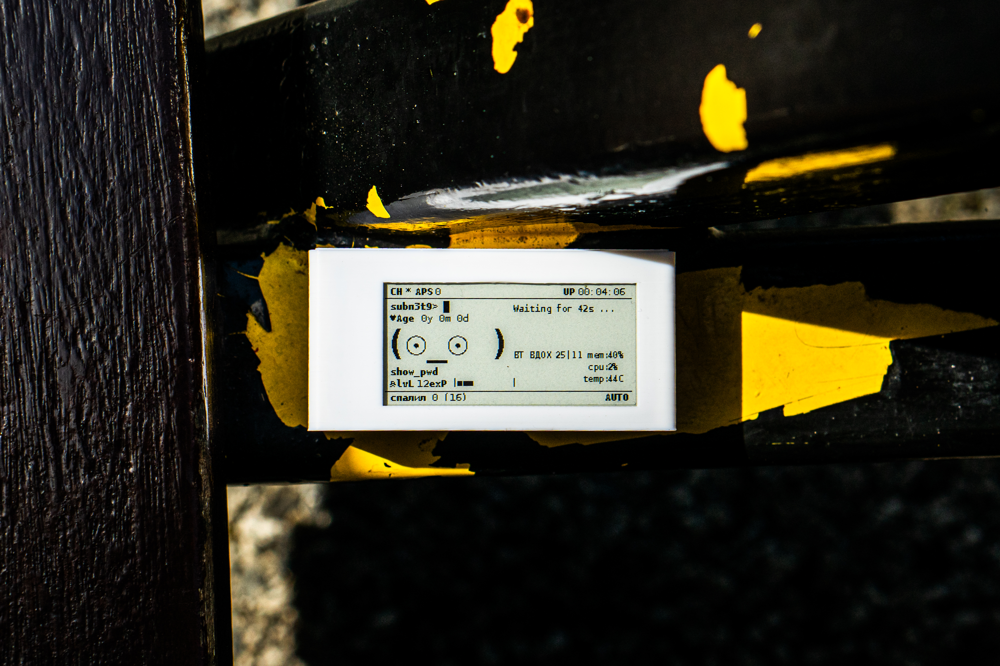

# Pwnagotchi-Project
🧠 My Custom Pwnagotchi Build (Zero 2 WH Edition)

Hey there! 👋  
This is my custom Pwnagotchi setup based on the Raspberry Pi Zero 2 WH, featuring a crisp Waveshare e-ink display and powered by a PiSugar S UPS. I built this mostly for educational WiFi research, CTF learning, and honestly, just because it looks awesome on a bench 😄

## 🧰 What’s Inside (Hardware Specs)

### ✅ Raspberry Pi Zero 2 WH  
- 1GHz Quad-Core ARM Cortex-A53 (way snappier than the old Zero W)  
- Onboard WiFi & Bluetooth 4.2 BLE  
- Comes with a pre-soldered header — no messing with an iron  

### ✅ Waveshare 2.13" E-Ink Display (V4, HAT+ version)  
- 250x122 crisp resolution  
- SPI interface  
- Perfect for that moody little Pwnagotchi face and system stats  

### ✅ PiSugar S UPS (1200mAh Li-ion)  
- Great fit for Pi Zero form factor  
- Recharges via USB  
- Powers my rig during walks, train rides, and coffee shop lurking  

### ✅ SanDisk 32GB Ultra microSDHC (A1, UHS-I, Class 10)  
- Comes pre-flashed with my own tweaked Pwnagotchi image  
- Fast, reliable storage for all those juicy `.pcap`s  

### ✅ Custom 3D Printed Case  ( Case found here : https://makerworld.com/en/models/219507-pwnagotchi-wavesharev4-pisugar2-case#profileId-238242 ) 
- Compact and durable  
- Designed specifically for this combo  
- Sleek, minimal look with enough port clearance  

    

---

## 🧑‍💻 What is Pwnagotchi?

> Pwnagotchi is an AI-powered WiFi hacking tool that passively listens for WiFi handshakes and learns how to optimize its performance over time.

It’s a great little companion for:
- 🧠 Learning about wireless networks  
- 🔐 Practicing ethical hacking in your lab  
- 🧪 Capturing WPA/WPA2 handshakes for later cracking  
- 🤖 Watching a cute ASCII face grow smarter over time  

---

## 🔧 How I Built It (Step-by-Step)

### 1. Flash the SD Card  

I grabbed the latest Pwnagotchi image from the official repo and flashed it using Imager

Follow jayofelony fork setup for internet adapter settings. 

## Share Network Configurations 

Using nmcli (easier, NetworkManager users)
If your Linux host uses NetworkManager (most modern distros do):

On linux : 

## Plugin that Should Work : 

## Configurations of Main config.toml

so here we got our /etc/pwnagotchi/config.toml 

What i would suggest is making seperate config.bak ( backup) so we dont loose original. If things go "sidways"
like they did go for me, when installing Plugins and finding the ones that work takes some time and succces/error procedures :D 

## 2. Install Display
The Waveshare V4 HAT+ connects directly to the Pi header (no wiring needed). I used standoffs to stabilize it inside the case.

## 3. Power It Up
The PiSugar S fits directly on the GPIO underside and powers the whole rig beautifully. It even gives a clean shutdown button if you enable it.

## 4. Case It (Case found here : https://makerworld.com/en/models/219507-pwnagotchi-wavesharev4-pisugar2-case#profileId-238242 )
I designed ( ofcourse i did not :D ) (downloaded) a custom 3D-printed case for this exact combo. Used white PLA for this build. Compact, tough, and photogenic 😎

## 5. Configure Plugins

Already included in my build:

    ✅ EXP, AGE, LVL tracking

    ✅ memtemp for real-time stats

    ✅ show_pwd to monitor captured handshakes

    ✅ Bluetooth tethering for remote access and syncing

##################

⚠️ Disclaimer

This device is strictly for educational, ethical hacking, and research purposes.
Please do not use it on networks you don’t own or have explicit permission to test.
Always follow your local laws and responsible disclosure policies.

##################

HUGE SHOUTOUT TO : 

Pwnagotchi Project

Jaylofelony Fork

Waveshare Display Docs

Big shoutout to the Pwnagotchi community for all the plugins, support, and memes.

